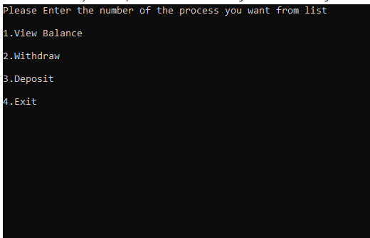

# Unit-Testing

## ATM

welcome to My ATM Machine, here you can see Your Balance, add to it and do deduction.

***
### using inctruction :

1. a Process list will be shown

2. you have to Entere one number each time.
3. if you Entered number 1 your Balance will be shown.

4. you can do deduction process by Entering number 2
after it will ask you to Enter the value of truncated.
*if the  Process done successfuly this message will be shown
 _the Proccess Done successfuly_**
*if You Entered a Value more than Your Balance this message will be shown
* if you Your Balance is Zero this message will be shown
_Your Balance is 0 we can't complete the Process_**
* if you Entered a Negative value this message will be shown 
_the Proccess did Not completed You Entered a Negative value_**

5. you can add to your Balance by Entered number 3
* if the  Process done successfuly this message will be show
_the Proccess Done successfuly_**
* if You Entered a  negative Value this message will be shown
_the Proccess did Not completed Your Entered a Negative value_**
6. this messge will be shown if you Entered No value for deduction or deposit process 
_the Proccess did Not completed You did Not Enter any Value_**
7. you can Exit by Entereing number 4.

